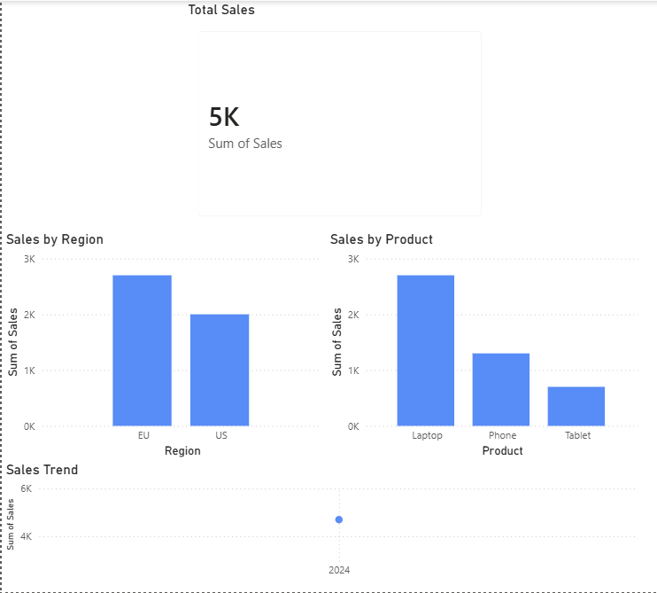

# Sales Analytics Dashboard

# Overview
This project presents a simple and interactive sales dashboard built using Power BI. It focuses on analyzing sales performance across regions, products, and time.

# Tools Used
- Power BI
- CSV dataset
- Data cleaning and transformation

# Dataset
The dataset includes:
- Date
- Product
- Region
- Sales

# Dashboard Features
- Sales by Region
- Sales by Product
- Sales Trend over Time
- Total Sales KPI
  
## Preview

## Project Structure

Project_1/
─>data/sales.csv
─> dashboard/sales_dashboard.pbix
─> screenshots/dashboard.png

# Key Learnings

- Data cleaning and preparation
- Building dashboards in Power BI
- Visualizing business data

# Author
Ayman Shehzadi
Masters in Artificial Intelligence
Ayman Shehzadi
Master’s in Artificial Intelligence
